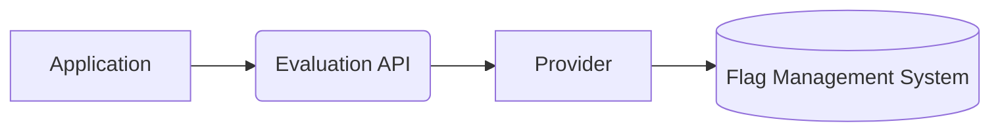

# A short history

<div class="text-sm opacity-70 -mt-2 mb-8">Born in public as a multi-vendor effort — open from day one.</div>

<div class="grid grid-cols-4 gap-4 mt-8">

  <div class="flex flex-col items-center text-center gap-2 p-4 rounded border border-gray-300">
    <carbon:bullhorn class="text-3xl opacity-80"/>
    <div class="text-lg font-semibold">May 2022</div>
    <div class="text-sm opacity-80">Announced at <strong>KubeCon Valencia</strong> — a coalition of flag-vendor engineers inviting the community to contribute</div>
  </div>

  <div class="flex flex-col items-center text-center gap-2 p-4 rounded border border-gray-300">
    <carbon:idea class="text-3xl opacity-80"/>
    <div class="text-lg font-semibold">June 2022</div>
    <div class="text-sm opacity-80">Accepted into the <strong>CNCF Sandbox</strong> — an open-governance home from the start</div>
  </div>

  <div class="flex flex-col items-center text-center gap-2 p-4 rounded border border-gray-300">
    <carbon:growth class="text-3xl opacity-80"/>
    <div class="text-lg font-semibold">Nov 2023</div>
    <div class="text-sm opacity-80">Promoted to <strong>CNCF Incubating</strong> — stable spec, 1.0 SDKs across major languages</div>
  </div>

  <div class="flex flex-col items-center text-center gap-2 p-4 rounded border border-gray-300">
    <carbon:collaborate class="text-3xl opacity-80"/>
    <div class="text-lg font-semibold">Today</div>
    <div class="text-sm opacity-80">A <strong>collaborative, multi-vendor</strong> standard with broad adoption</div>
  </div>

</div>

---


# Why did it need to exist?

<div class="grid grid-cols-3 gap-6 mt-8 items-stretch">
  <div class="rounded-lg border border-gray-200 shadow-sm p-6 text-center flex flex-col items-center gap-3 h-full">
    <carbon:view class="text-5xl opacity-70"/>
    <div class="font-bold text-lg">Observability</div>
    <div class="text-sm opacity-70">See what flags actually do in production — which ones fire, which error, which never evaluate.</div>
  </div>
  <div class="rounded-lg border border-gray-200 shadow-sm p-6 text-center flex flex-col items-center gap-3 h-full">
    <carbon:analytics class="text-5xl opacity-70"/>
    <div class="font-bold text-lg">Insights</div>
    <div class="text-sm opacity-70">Understand evaluation patterns across services, tenants, regions — one shared signal.</div>
  </div>
  <div class="rounded-lg border border-gray-200 shadow-sm p-6 text-center flex flex-col items-center gap-3 h-full">
    <carbon:user-multiple class="text-5xl opacity-70"/>
    <div class="font-bold text-lg">Shared pain</div>
    <div class="text-sm opacity-70">Every org re-invented the same abstraction. Reach for a standard instead.</div>
  </div>
</div>

<div class="mt-8 p-4 rounded border border-gray-200 text-sm flex items-start gap-3">
  <carbon:play-outline class="text-xl opacity-70 shrink-0 mt-0.5"/>
  <div>
    For the concrete internal pains that sparked it, see my previous talk:
    <a href="https://www.youtube.com/watch?v=pvjmPTTyCfc" target="_blank">youtube.com/watch?v=pvjmPTTyCfc</a>
  </div>
</div>

---
layout: statement
---

OpenFeature is an <span v-mark.highlight.yellow="1">open specification</span> that provides a <span v-mark.highlight.yellow="2">vendor-agnostic, community-driven API</span> for feature flagging that works with your favorite feature flag management tool.

<div class="abs-br m-6 flex items-end gap-2">
  <a href="https://openfeature.dev/docs/reference/intro" target="_blank" class="text-xs opacity-80 hover:opacity-100 text-right leading-tight pb-1 !text-inherit">
    <div>OpenFeature Specification intro</div>
    <div class="font-mono text-[10px] opacity-80 mt-0.5">openfeature.dev/docs/reference/intro</div>
  </a>
  <div class="bg-white p-1 rounded dark:invert">
    <QRCode data="https://openfeature.dev/docs/reference/intro" :width="90" :height="90" :margin="2" />
  </div>
</div>

---
layout: default
---

# Flow

<div class="flex justify-center mt-12">



</div>

<div class="text-sm opacity-70 text-center mt-8">
  Your code talks to the Evaluation API. The Provider adapts to whichever flag management tool you use.
</div>

<div class="abs-br m-6 flex items-end gap-2">
  <a href="https://openfeature.dev/specification/sections/providers" target="_blank" class="text-xs opacity-60 hover:opacity-100 text-right leading-tight pb-1 !text-inherit">
    <div>Providers — OpenFeature spec</div>
    <div class="font-mono text-[10px] opacity-80 mt-0.5">openfeature.dev/specification/sections/providers</div>
  </a>
  <div class="bg-white p-1 rounded dark:invert">
    <QRCode data="https://openfeature.dev/specification/sections/providers" :width="90" :height="90" :margin="2" />
  </div>
</div>

---
layout: two-cols
---

# Basic usage

<div class="pt-4 space-y-6 text-base">
  <v-click at="1">
    <div>
      <div class="font-bold">Get the API and register a provider</div>
      <div class="opacity-75 text-sm">The API is the single entry point. A provider connects OpenFeature to your flag source.</div>
    </div>
  </v-click>
  <v-click at="2">
    <div>
      <div class="font-bold">Grab a client</div>
      <div class="opacity-75 text-sm">Clients are cheap to create and scope evaluations.</div>
    </div>
  </v-click>
  <v-click at="3">
    <div>
      <div class="font-bold">Evaluate a flag</div>
      <div class="opacity-75 text-sm">Name, default value — always returns <em>something</em>.</div>
    </div>
  </v-click>
</div>

::right::

<div class="text-xs font-mono uppercase tracking-wider opacity-60 mb-2">
  <span v-if="$clicks < 4">Java</span>
  <span v-else-if="$clicks === 4">Node.js</span>
  <span v-else>Go</span>
</div>

<div v-if="$clicks < 4">

````md magic-move {lines:true}
```java
// walking through the API step by step
```
```java {1-2}
var api = OpenFeatureAPI.getInstance();
api.setProviderAndWait(new InMemoryProvider(myFlags));
```
```java {4}
var api = OpenFeatureAPI.getInstance();
api.setProviderAndWait(new InMemoryProvider(myFlags));

var client = api.getClient();
```
```java {6-7}
var api = OpenFeatureAPI.getInstance();
api.setProviderAndWait(new InMemoryProvider(myFlags));

var client = api.getClient();

boolean on = client.getBooleanValue(
    "v2_enabled", false);
```
````

</div>

<div v-else-if="$clicks === 4">

```ts {lines:true}
import { OpenFeature } from '@openfeature/server-sdk';

await OpenFeature.setProviderAndWait(new YourProvider());

const client = OpenFeature.getClient();

const on = await client.getBooleanValue(
    'v2_enabled', false);
```

</div>

<div v-else>

```go {lines:true}
openfeature.SetProvider(openfeature.NoopProvider{})

client := openfeature.NewClient("my-app")

on, _ := client.BooleanValue(
    context.Background(),
    "v2_enabled",
    false,
    openfeature.EvaluationContext{})
```

</div>

<div class="text-xs opacity-60 pt-2">
  <a v-if="$clicks < 4" href="https://openfeature.dev/docs/reference/technologies/server/java" target="_blank">openfeature.dev — Java SDK</a>
  <a v-else-if="$clicks === 4" href="https://openfeature.dev/docs/reference/technologies/server/javascript" target="_blank">openfeature.dev — JavaScript SDK</a>
  <a v-else href="https://openfeature.dev/docs/reference/technologies/server/go" target="_blank">openfeature.dev — Go SDK</a>
</div>

<v-click at="4" hide><span></span></v-click>
<v-click at="5" hide><span></span></v-click>

---


# Supported Types

<div class="text-center text-lg opacity-75 mb-8">Four core types in the spec. Language specifics differ.</div>

<div class="grid grid-cols-4 gap-6 items-stretch">

<v-click at="1">
<div class="rounded-lg border border-gray-200 shadow-sm p-5 flex flex-col items-center gap-3 h-full text-center">
  <carbon:boolean class="text-5xl opacity-70"/>
  <div class="font-bold text-lg">Boolean</div>
  <div class="text-xs opacity-70">true / false — the bread-and-butter flag</div>
</div>
</v-click>

<v-click at="2">
<div class="rounded-lg border border-gray-200 shadow-sm p-5 flex flex-col items-center gap-3 h-full text-center">
  <carbon:string-text class="text-5xl opacity-70"/>
  <div class="font-bold text-lg">String</div>
  <div class="text-xs opacity-70">variant names, region codes, labels</div>
</div>
</v-click>

<v-click at="3">
<div class="rounded-lg border border-gray-200 shadow-sm p-5 flex flex-col items-center gap-3 h-full text-center">
  <carbon:number-0 class="text-5xl opacity-70"/>
  <div class="font-bold text-lg">Number</div>
  <div class="text-xs opacity-70 leading-snug">
    Java: <code>int</code> + <code>double</code><br/>
    Go / Python: <code>int</code> + <code>float</code><br/>
    JS: one <code>number</code>
  </div>
</div>
</v-click>

<v-click at="4">
<div class="rounded-lg border border-gray-200 shadow-sm p-5 flex flex-col items-center gap-3 h-full text-center">
  <carbon:data-structured class="text-5xl opacity-70"/>
  <div class="font-bold text-lg">Object</div>
  <div class="text-xs opacity-70">structured JSON-like values</div>
</div>
</v-click>

</div>

<div class="text-xs opacity-60 text-center mt-8 italic">
  The method name reflects the return type — e.g. <code>getBooleanValue</code>, <code>getStringValue</code>, <code>getNumberValue</code>, <code>getObjectValue</code>.
</div>

---
layout: default
---

# The default is mandatory

<div class="text-sm opacity-70 -mt-2 mb-6">Every evaluation call takes a fallback — the SDK always returns <em>something</em>.</div>

```java
boolean on = client.getBooleanValue("v2_enabled", false);
//                                                ^^^^^
//                                      the fallback — non-optional
```

<div class="grid grid-cols-2 gap-4 mt-8">
  <div class="p-4 rounded border border-gray-200 flex items-start gap-3">
    <carbon:cloud-offline class="text-2xl opacity-70 mt-0.5 shrink-0"/>
    <div>
      <div class="font-bold text-sm">Provider unreachable</div>
      <div class="text-xs opacity-70">Network down, tenant offline → you still get <code>false</code>.</div>
    </div>
  </div>
  <div class="p-4 rounded border border-gray-200 flex items-start gap-3">
    <carbon:search class="text-2xl opacity-70 mt-0.5 shrink-0"/>
    <div>
      <div class="font-bold text-sm">Flag key missing</div>
      <div class="text-xs opacity-70">Typo, not yet created → fallback wins.</div>
    </div>
  </div>
  <div class="p-4 rounded border border-gray-200 flex items-start gap-3">
    <carbon:warning class="text-2xl opacity-70 mt-0.5 shrink-0"/>
    <div>
      <div class="font-bold text-sm">Type mismatch</div>
      <div class="text-xs opacity-70">Flag returns a string where a bool was asked → fallback wins.</div>
    </div>
  </div>
  <div class="p-4 rounded border border-gray-200 flex items-start gap-3">
    <carbon:error class="text-2xl opacity-70 mt-0.5 shrink-0"/>
    <div>
      <div class="font-bold text-sm">Evaluation error</div>
      <div class="text-xs opacity-70">Rule engine throws, hook blows up → fallback wins.</div>
    </div>
  </div>
</div>

<div class="text-sm opacity-80 text-center mt-6">
  Your code path <b>always</b> has a value to work with.
</div>

---
layout: fact
---

# Evaluation API

One API. Many languages. Never breaks your code.

<blockquote class="text-sm opacity-70 italic mt-8 max-w-3xl mx-auto border-l-4 border-gray-300 pl-4 text-left">
  The Evaluation API is the <b>primary component of OpenFeature that application authors interact with</b>. The Evaluation API allows developers to evaluate feature flags to alter control flow and application characteristics.
</blockquote>

<div class="abs-br m-6 flex items-end gap-2">
  <a href="https://openfeature.dev/docs/reference/concepts/evaluation-api" target="_blank" class="text-xs opacity-60 hover:opacity-100 text-right leading-tight pb-1 !text-inherit">
    <div>Evaluation API — concept docs</div>
    <div class="font-mono text-[10px] opacity-80 mt-0.5">openfeature.dev/docs/reference/concepts/evaluation-api</div>
  </a>
  <div class="bg-white p-1 rounded dark:invert">
    <QRCode data="https://openfeature.dev/docs/reference/concepts/evaluation-api" :width="90" :height="90" :margin="2" />
  </div>
</div>

---
layout: image
image: /img/breaks/mist-mountain.jpg
---

