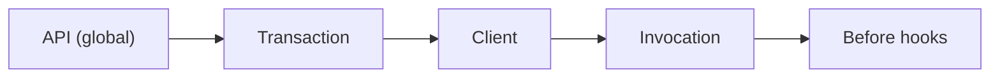

# Problem 2

## Static flags aren't enough

You need rulesets — per user, per tenant, per experiment.

---


# Why dynamic evaluation?

<div class="grid grid-cols-2 gap-4 mt-8 text-lg">
  <div class="p-4 rounded border border-gray-300">🧪 A/B testing</div>
  <div class="p-4 rounded border border-gray-300">🔒 Quality assurance</div>
  <div class="p-4 rounded border border-gray-300">💎 Premium users</div>
  <div class="p-4 rounded border border-gray-300">🍖 Dogfooding</div>
  <div class="p-4 rounded border border-gray-300 col-span-2">⚖️ Compliance / regional constraints</div>
</div>

---


# A flagd config with targeting

```json {3|5-8|10-19}
{
  "flags": {
    "v2_enabled": {
      "state": "ENABLED",
      "variants": {
        "on": true,
        "off": false
      },
      "defaultVariant": "off",
      "targeting": {
        "if": [
          { "ends_with": [ { "var": "email" }, "@domain.com" ] },
          "on",
          "off"
        ]
      }
    }
  }
}
```

<div class="text-xs opacity-60 mt-4">
  <carbon:information class="inline-block align-middle" /> This is flagd's rule syntax. Every provider configures targeting differently — OpenFeature standardises the <em>input</em> to evaluation, not how rules are written.
</div>

---


# Concept: Evaluation Context

Pass contextual data to the evaluation — per request, per session, per tenant.

```java {1-5|6-7|9-10}
Map<String, Value> attrs = new HashMap<>();
attrs.put("email",
    new Value(session.getAttribute("email")));
attrs.put("product",
    new Value("productId"));
EvaluationContext reqCtx =
    new ImmutableContext(attrs);

boolean on =
    client.getBooleanValue("v2_enabled", false, reqCtx);
```

---
layout: statement
---

# What *else* could we target on?

<div class="text-xl opacity-70 mt-8">
  We've just seen user targeting. But the evaluation context can carry anything.
</div>

---
layout: default
---

# Operational context

<div class="text-lg opacity-70 mb-6">Feed the evaluation what's true about <em>your runtime</em>, not just the user.</div>

<div class="grid grid-cols-2 gap-6 mt-4 items-stretch">
  <div class="rounded-lg border border-gray-200 shadow-sm p-5 text-center flex flex-col items-center gap-2">
    <carbon:cloud class="text-4xl opacity-70"/>
    <div class="font-bold">Hosting</div>
    <div class="text-sm opacity-70">cloud, region, cluster, tenant</div>
  </div>
  <div class="rounded-lg border border-gray-200 shadow-sm p-5 text-center flex flex-col items-center gap-2">
    <carbon:code class="text-4xl opacity-70"/>
    <div class="font-bold">Runtime</div>
    <div class="text-sm opacity-70">Java / Node / Go version, JVM flags</div>
  </div>
  <div class="rounded-lg border border-gray-200 shadow-sm p-5 text-center flex flex-col items-center gap-2">
    <carbon:application class="text-4xl opacity-70"/>
    <div class="font-bold">App</div>
    <div class="text-sm opacity-70">version, release channel, feature branch</div>
  </div>
  <div class="rounded-lg border border-gray-200 shadow-sm p-5 text-center flex flex-col items-center gap-2">
    <carbon:mobile class="text-4xl opacity-70"/>
    <div class="font-bold">Platform</div>
    <div class="text-sm opacity-70">Android / iOS version, browser, OS</div>
  </div>
</div>

---
layout: default
---

# Reduce the bug radius

<div class="text-lg opacity-70 mb-6">Roll a fix out narrowly before widening.</div>

<div class="flex flex-col gap-3 mt-4">
  <div class="rounded-lg border border-gray-200 shadow-sm p-4 flex items-center gap-3">
    <carbon:arrow-right class="text-2xl opacity-50 shrink-0"/>
    <div>Enable on our <strong>staging</strong> cluster only — monitor before production</div>
  </div>
  <div class="rounded-lg border border-gray-200 shadow-sm p-4 flex items-center gap-3">
    <carbon:arrow-right class="text-2xl opacity-50 shrink-0"/>
    <div>Turn on for <strong>Android 14+</strong> users — older platforms aren't affected by the bug</div>
  </div>
  <div class="rounded-lg border border-gray-200 shadow-sm p-4 flex items-center gap-3">
    <carbon:arrow-right class="text-2xl opacity-50 shrink-0"/>
    <div>Roll out to the <strong>EU region</strong> first — we can react within business hours</div>
  </div>
</div>

---
layout: default
---

# Context on every call is tedious

<div class="text-lg opacity-70 mb-6">Passing the same context to every evaluation makes call sites noisy and easy to forget.</div>

```java
client.getBooleanValue("a", false, ctx);
client.getBooleanValue("b", false, ctx);
client.getBooleanValue("c", false, ctx);  // ... on every call
```

<div class="text-lg mt-8">Set it once. Let the SDK apply it everywhere.</div>

---


# Context at every level

<div class="text-sm opacity-70 -mt-2 mb-4">Set the context where the data actually lives — global, per-request, per-client, or per-call.</div>

```java {1-3|5-7|9-12|14}
// global — applies to every evaluation
OpenFeatureAPI.getInstance().setEvaluationContext(
    new MutableContext().add("region", "eu"));

// transaction — for the current request / unit of work
OpenFeatureAPI.getInstance().setTransactionContext(
    new MutableContext().add("requestId", id));

// client — scoped to one client (e.g. one domain)
var client = api.getClient("checkout");
client.setEvaluationContext(
    new MutableContext().add("domain", "checkout"));

// invocation — passed at the call site (we just saw this)
client.getBooleanValue("v2_enabled", false, callCtx);
```

---
layout: default
---

# Merge Order

<div class="flex justify-center mt-10">



</div>

<div class="text-sm opacity-70 text-center mt-8">
  Later stages override earlier ones — your invocation context wins over the global default.
</div>

<div class="abs-br m-6 flex items-end gap-2">
  <a href="https://openfeature.dev/specification/sections/evaluation-context#requirement-323" target="_blank" class="text-xs opacity-60 hover:opacity-100 text-right leading-tight pb-1 !text-inherit">
    <div>Evaluation context — spec §3.2.3</div>
    <div class="font-mono text-[10px] opacity-80 mt-0.5">openfeature.dev/specification/sections/evaluation-context</div>
  </a>
  <div class="bg-white p-1 rounded dark:invert">
    <QRCode data="https://openfeature.dev/specification/sections/evaluation-context#requirement-323" :width="90" :height="90" :margin="2" />
  </div>
</div>

---
layout: default
---

# Percentage rollouts

<div class="text-sm opacity-70 -mt-2 mb-8">Turn a feature on for <b>10%</b> of users. Next week, <b>50%</b>. Then everyone.</div>

<div class="grid grid-cols-3 gap-6 mt-4">
  <div class="p-6 rounded-lg border border-gray-200 shadow-sm text-center">
    <div class="text-5xl font-bold opacity-70">10%</div>
    <div class="text-sm opacity-70 mt-2">canary cohort</div>
  </div>
  <div class="p-6 rounded-lg border border-gray-200 shadow-sm text-center">
    <div class="text-5xl font-bold opacity-70">50%</div>
    <div class="text-sm opacity-70 mt-2">controlled rollout</div>
  </div>
  <div class="p-6 rounded-lg border border-gray-200 shadow-sm text-center">
    <div class="text-5xl font-bold opacity-70">100%</div>
    <div class="text-sm opacity-70 mt-2">general availability</div>
  </div>
</div>

<div class="text-sm opacity-70 text-center mt-8">
  The SDK picks who's in each bucket. But <em>how</em> should it pick?
</div>

---
layout: statement
---

# The determinism problem

<div class="text-xl opacity-70 mt-8 max-w-3xl mx-auto">
  Pick randomly every evaluation, and the same user flips in and out of the feature on every request.
  <br/><br/>
  <b>That's not a rollout — that's chaos.</b>
</div>

---


# Targeting Key

<div class="text-sm opacity-70 -mt-2 mb-6">A stable, unique identifier for the subject being evaluated. Gives the SDK something to hash consistently.</div>

- **Subject identifier** — user id, session id, tenant id, device id, …
- Same key → same bucket, every time
- Percentage / fractional evaluations become **deterministic**

```java
String targetingKey = session.getId();
EvaluationContext reqCtx =
    new ImmutableContext(targetingKey, requestAttrs);
```

---
layout: fact
---

# Evaluation Context

Dynamic evaluation · Deterministic targeting · Reduce blast radius.

<blockquote class="text-sm opacity-70 italic mt-8 max-w-3xl mx-auto border-l-4 border-gray-300 pl-4 text-left">
  The evaluation context is a <b>container for arbitrary contextual data that can be used as a basis for dynamic evaluation</b>.
</blockquote>

<div class="abs-br m-6 flex items-end gap-2">
  <a href="https://openfeature.dev/docs/reference/concepts/evaluation-context" target="_blank" class="text-xs opacity-60 hover:opacity-100 text-right leading-tight pb-1 !text-inherit">
    <div>Evaluation Context — concept docs</div>
    <div class="font-mono text-[10px] opacity-80 mt-0.5">openfeature.dev/docs/reference/concepts/evaluation-context</div>
  </a>
  <div class="bg-white p-1 rounded dark:invert">
    <QRCode data="https://openfeature.dev/docs/reference/concepts/evaluation-context" :width="90" :height="90" :margin="2" />
  </div>
</div>

---
layout: image
image: /img/breaks/frost-fence.jpg
---

