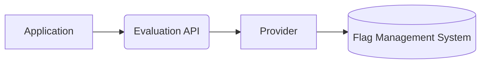
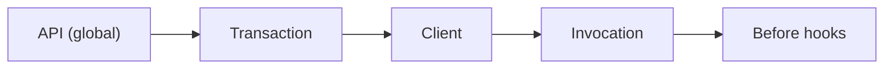

# Fun with Flags

## How OpenFeature Solves Your Feature Flag Headaches

<div class="pt-8 opacity-90 text-sm space-y-1">
  <div>Simon Schrottner · OpenFeature maintainer · CNCF Ambassador</div>
  <div><carbon:email class="inline"/> simon.schrottner@gmail.com &nbsp;·&nbsp;
       <carbon:logo-github class="inline"/> aepfli &nbsp;·&nbsp;
       <carbon:logo-linkedin class="inline"/> in/aepfli</div>
</div>

<!--
  Narrative rhythm (do not break):
    Hook (Knight Capital) → Who I am → What are FFs → OpenFeature intro
    → Loop 1: Problem (Lock-in)        → Concept (Providers)           → Recap
    → Loop 2: Problem (Dynamic eval)   → Concept (Evaluation Context)  → Recap
    → Loop 3: Problem (Obsolete flags) → Concept (Hooks)               → Recap
    → Take-aways (all concepts)
    → CTA (community + try it)
-->

---
layout: section
---

# How *not* to do Feature Flags

A cautionary tale: Knight Capital Group, August 2012.

---
layout: image
image: /img/knight_capital.webp
---

---
layout: default
---

# What happened

<v-clicks>

- Lost **half a billion USD**
- ... in **one hour**
- ... due to a **feature flag**
- ... they **repurposed**

</v-clicks>

<div class="abs-br m-6 flex items-end gap-2">
  <a href="https://blog.statsig.com/how-to-lose-half-a-billion-dollars-with-bad-feature-flags-ccebb26adeec" target="_blank" class="text-xs opacity-60 hover:opacity-100 text-right leading-tight pb-1 !text-inherit">
    <div>statsig.com — how to lose half a billion dollars</div>
    <div class="font-mono text-[10px] opacity-80 mt-0.5">blog.statsig.com</div>
  </a>
  <div class="bg-white p-1 rounded dark:invert">
    <QRCode data="https://blog.statsig.com/how-to-lose-half-a-billion-dollars-with-bad-feature-flags-ccebb26adeec" :width="90" :height="90" :margin="2" />
  </div>
</div>

---
layout: intro
---

# Fun with Flags

## How OpenFeature Solves Your Feature Flag Headaches

<div class="pt-8 opacity-90 text-sm space-y-1">
  <div>Simon Schrottner · OpenFeature maintainer · CNCF Ambassador</div>
  <div><carbon:email class="inline"/> simon.schrottner@gmail.com &nbsp;·&nbsp;
       <carbon:logo-github class="inline"/> aepfli &nbsp;·&nbsp;
       <carbon:logo-linkedin class="inline"/> in/aepfli</div>
</div>

---
layout: image-right
image: /img/simon.jpg
---

# Who am I?

**Simon Schrottner**

<div class="grid grid-cols-2 gap-4 mt-6">
  <div class="rounded border border-gray-200 p-4 text-center flex flex-col items-center justify-between">
    
    <div class="text-sm mt-3">OpenFeature Maintainer</div>
  </div>
  <div class="rounded border border-gray-200 p-4 text-center flex flex-col items-center justify-between">
    <div class="dark:bg-white dark:p-2 dark:rounded">
      
    </div>
    <div class="text-sm mt-3">CNCF Ambassador</div>
  </div>
</div>

<div class="pt-4 text-sm opacity-70">Open Source enthusiast</div>

<div class="pt-6 text-xs opacity-70 space-y-1">
  <div><carbon:email class="inline"/> simon.schrottner@gmail.com</div>
  <div><carbon:logo-github class="inline"/> aepfli &nbsp; <carbon:logo-linkedin class="inline"/> in/aepfli</div>
  <div>🦋 @aepfli.bsky.social</div>
</div>

---
layout: default
---

# Agenda

<div class="grid grid-cols-3 gap-8 mt-8 items-stretch">

<v-clicks>

<div class="rounded-lg border border-gray-200 overflow-hidden shadow-sm flex flex-col h-full">
  <div class="bg-gray-50 p-4 flex items-center justify-center h-40">
    
  </div>
  <div class="p-4 flex flex-col gap-1">
    <div class="text-3xl opacity-40 leading-none">1</div>
    <div class="text-lg font-semibold">Feature Flags</div>
    <div class="text-sm opacity-70">What they are, why we use them.</div>
  </div>
</div>

<div class="rounded-lg border border-gray-200 overflow-hidden shadow-sm flex flex-col h-full">
  <div class="bg-gray-50 p-4 flex items-center justify-center h-40">
    
  </div>
  <div class="p-4 flex flex-col gap-1">
    <div class="text-3xl opacity-40 leading-none">2</div>
    <div class="text-lg font-semibold">OpenFeature</div>
    <div class="text-sm opacity-70">A vendor-agnostic standard.</div>
  </div>
</div>

<div class="rounded-lg border border-gray-200 overflow-hidden shadow-sm flex flex-col h-full">
  <div class="bg-gray-50 p-4 flex items-center justify-center h-40">
    
  </div>
  <div class="p-4 flex flex-col gap-1">
    <div class="text-3xl opacity-40 leading-none">3</div>
    <div class="text-lg font-semibold">Pitfalls & Fixes</div>
    <div class="text-sm opacity-70">Three problems. Three concepts. One rhythm.</div>
  </div>
</div>

</v-clicks>

</div>

---
layout: section
---

# Feature Flags

## What are they — and why bother?

---
layout: statement
---

Feature flags <span v-mark.highlight.yellow="1">enable, disable, or change behavior</span> of features in a product or service <span v-mark.highlight.yellow="2">at runtime</span> — <span v-mark.highlight.yellow="3">without modifying the source code</span>.

---
layout: default
---

# Coordinate & Target

<div class="grid grid-cols-3 gap-6 mt-8 items-stretch">
  <div class="rounded-lg border border-gray-200 shadow-sm p-6 text-center flex flex-col items-center gap-3 h-full">
    <carbon:time class="text-5xl opacity-70"/>
    <div class="font-bold text-lg">Synchronized rollouts</div>
    <div class="text-sm opacity-70">ship a new feature to every service at the same moment, without coordinating deploys</div>
  </div>
  <div class="rounded-lg border border-gray-200 shadow-sm p-6 text-center flex flex-col items-center gap-3 h-full">
    <carbon:chart-multi-line class="text-5xl opacity-70"/>
    <div class="font-bold text-lg">A/B experiments</div>
    <div class="text-sm opacity-70">serve two variants, measure which wins, close the loop with data</div>
  </div>
  <div class="rounded-lg border border-gray-200 shadow-sm p-6 text-center flex flex-col items-center gap-3 h-full">
    <carbon:user-multiple class="text-5xl opacity-70"/>
    <div class="font-bold text-lg">Targeted release</div>
    <div class="text-sm opacity-70">beta testers, enterprise tier, a single region — each sees a different flag value</div>
  </div>
</div>

---
layout: default
---

# Reduce Risk

<div class="grid grid-cols-3 gap-6 mt-8 items-stretch">
  <div class="rounded-lg border border-gray-200 shadow-sm p-6 text-center flex flex-col items-center gap-3 h-full">
    <carbon:launch class="text-5xl opacity-70"/>
    <div class="font-bold text-lg">Deploy ≠ release</div>
    <div class="text-sm opacity-70">ship code dark; turn it on later without redeploying</div>
  </div>
  <div class="rounded-lg border border-gray-200 shadow-sm p-6 text-center flex flex-col items-center gap-3 h-full">
    <carbon:stop-outline class="text-5xl opacity-70"/>
    <div class="font-bold text-lg">Kill switch</div>
    <div class="text-sm opacity-70">disable a bad feature in seconds, no revert, no rebuild</div>
  </div>
  <div class="rounded-lg border border-gray-200 shadow-sm p-6 text-center flex flex-col items-center gap-3 h-full">
    <carbon:chart-line class="text-5xl opacity-70"/>
    <div class="font-bold text-lg">Progressive rollout</div>
    <div class="text-sm opacity-70">1% → 10% → 100%, monitoring errors as you ramp</div>
  </div>
</div>

---
layout: default
---

# Categories of Feature Flags

Those use-cases aren't all the same kind of flag — they differ in **longevity** and **dynamism**.

<div class="flex justify-center mt-2">
  
</div>

<div class="abs-br m-6 flex items-end gap-2">
  <a href="https://martinfowler.com/articles/feature-toggles.html" target="_blank" class="text-xs opacity-60 hover:opacity-100 text-right leading-tight pb-1 !text-inherit">
    <div>Pete Hodgson — Feature Flag Types</div>
    <div class="font-mono text-[10px] opacity-80 mt-0.5">martinfowler.com/articles/feature-toggles.html</div>
  </a>
  <div class="bg-white p-1 rounded dark:invert">
    <QRCode data="https://martinfowler.com/articles/feature-toggles.html" :width="90" :height="90" :margin="2" />
  </div>
</div>

---
layout: two-cols
---

# Feature Flagging Maturity

<div class="text-sm opacity-70 mt-1">Different organisations sit at different stages of adoption.</div>

<div class="bg-white dark:bg-transparent rounded-lg shadow-sm dark:shadow-none p-3 flex items-center justify-center mt-3" style="height: 400px;">
  
  
  
  
  
</div>

::right::

<v-switch unmount at="1" class="mt-16">
  <template #1>
    <div class="space-y-3">
      <div class="text-xs uppercase tracking-wider opacity-60">Level 1 — The ENV_VAR swamp</div>
      <p class="text-lg opacity-85">Hand-rolled booleans, env vars, and config files scattered across services. No central control. Changes require a redeploy.</p>
    </div>
  </template>
  <template #2>
    <div class="space-y-3">
      <div class="text-xs uppercase tracking-wider opacity-60">Level 2 — Dynamic configuration</div>
      <p class="text-lg opacity-85">A single place to flip flags without redeploying. Operations-friendly — you can disable a bad feature in seconds.</p>
    </div>
  </template>
  <template #3>
    <div class="space-y-3">
      <div class="text-xs uppercase tracking-wider opacity-60">Level 3 — Dynamic evaluation</div>
      <p class="text-lg opacity-85">Per-user, per-segment, per-tenant targeting. Experimentation. Personalisation. Progressive rollouts.</p>
    </div>
  </template>
  <template #4>
    <div class="space-y-3">
      <div class="text-xs uppercase tracking-wider opacity-60">Level 4 — Operationalized Feature-Flags</div>
      <p class="text-lg opacity-85">Flags treated like any other part of the SDLC — ownership, cleanup policies, audit trails, observability wired in by default.</p>
    </div>
  </template>
</v-switch>

---
layout: image
image: /img/breaks/spring-blossoms.jpg
---

---
layout: center
---

<span class="sr-only">OpenFeature</span>

<div class="flex flex-col items-center gap-6 mt-4">
  
  <div class="text-xl opacity-80 text-center max-w-2xl">A vendor-agnostic, community-driven standard for feature flagging</div>
  <div class="flex flex-col items-center gap-1 mt-4">
    
    
    <div class="text-xs opacity-60">CNCF Incubating project</div>
  </div>
</div>

---

# A short history

<div class="text-sm opacity-70 -mt-2 mb-8">Born in public as a multi-vendor effort — open from day one.</div>

<div class="grid grid-cols-4 gap-4 mt-8">

  <div class="flex flex-col items-center text-center gap-2 p-4 rounded border border-gray-300">
    <carbon:bullhorn class="text-3xl opacity-80"/>
    <div class="text-lg font-semibold">May 2022</div>
    <div class="text-sm opacity-80">Announced at <strong>KubeCon Valencia</strong> — a coalition of flag-vendor engineers inviting the community to contribute</div>
  </div>

  <div class="flex flex-col items-center text-center gap-2 p-4 rounded border border-gray-300">
    <carbon:idea class="text-3xl opacity-80"/>
    <div class="text-lg font-semibold">June 2022</div>
    <div class="text-sm opacity-80">Accepted into the <strong>CNCF Sandbox</strong> — an open-governance home from the start</div>
  </div>

  <div class="flex flex-col items-center text-center gap-2 p-4 rounded border border-gray-300">
    <carbon:growth class="text-3xl opacity-80"/>
    <div class="text-lg font-semibold">Nov 2023</div>
    <div class="text-sm opacity-80">Promoted to <strong>CNCF Incubating</strong> — stable spec, 1.0 SDKs across major languages</div>
  </div>

  <div class="flex flex-col items-center text-center gap-2 p-4 rounded border border-gray-300">
    <carbon:collaborate class="text-3xl opacity-80"/>
    <div class="text-lg font-semibold">Today</div>
    <div class="text-sm opacity-80">A <strong>collaborative, multi-vendor</strong> standard with broad adoption</div>
  </div>

</div>

---

# Why did it need to exist?

<div class="grid grid-cols-3 gap-6 mt-8 items-stretch">
  <div class="rounded-lg border border-gray-200 shadow-sm p-6 text-center flex flex-col items-center gap-3 h-full">
    <carbon:view class="text-5xl opacity-70"/>
    <div class="font-bold text-lg">Observability</div>
    <div class="text-sm opacity-70">See what flags actually do in production — which ones fire, which error, which never evaluate.</div>
  </div>
  <div class="rounded-lg border border-gray-200 shadow-sm p-6 text-center flex flex-col items-center gap-3 h-full">
    <carbon:analytics class="text-5xl opacity-70"/>
    <div class="font-bold text-lg">Insights</div>
    <div class="text-sm opacity-70">Understand evaluation patterns across services, tenants, regions — one shared signal.</div>
  </div>
  <div class="rounded-lg border border-gray-200 shadow-sm p-6 text-center flex flex-col items-center gap-3 h-full">
    <carbon:user-multiple class="text-5xl opacity-70"/>
    <div class="font-bold text-lg">Shared pain</div>
    <div class="text-sm opacity-70">Every org re-invented the same abstraction. Reach for a standard instead.</div>
  </div>
</div>

<div class="mt-8 p-4 rounded border border-gray-200 text-sm flex items-start gap-3">
  <carbon:play-outline class="text-xl opacity-70 shrink-0 mt-0.5"/>
  <div>
    For the concrete internal pains that sparked it, see my previous talk:
    <a href="https://www.youtube.com/watch?v=pvjmPTTyCfc" target="_blank">youtube.com/watch?v=pvjmPTTyCfc</a>
  </div>
</div>

---
layout: statement
---

OpenFeature is an <span v-mark.highlight.yellow="1">open specification</span> that provides a <span v-mark.highlight.yellow="2">vendor-agnostic, community-driven API</span> for feature flagging that works with your favorite feature flag management tool.

<div class="abs-br m-6 flex items-end gap-2">
  <a href="https://openfeature.dev/docs/reference/intro" target="_blank" class="text-xs opacity-80 hover:opacity-100 text-right leading-tight pb-1 !text-inherit">
    <div>OpenFeature Specification intro</div>
    <div class="font-mono text-[10px] opacity-80 mt-0.5">openfeature.dev/docs/reference/intro</div>
  </a>
  <div class="bg-white p-1 rounded dark:invert">
    <QRCode data="https://openfeature.dev/docs/reference/intro" :width="90" :height="90" :margin="2" />
  </div>
</div>

---
layout: default
---

# Flow

<div class="flex justify-center mt-12">



</div>

<div class="text-sm opacity-70 text-center mt-8">
  Your code talks to the Evaluation API. The Provider adapts to whichever flag management tool you use.
</div>

<div class="abs-br m-6 flex items-end gap-2">
  <a href="https://openfeature.dev/specification/sections/providers" target="_blank" class="text-xs opacity-60 hover:opacity-100 text-right leading-tight pb-1 !text-inherit">
    <div>Providers — OpenFeature spec</div>
    <div class="font-mono text-[10px] opacity-80 mt-0.5">openfeature.dev/specification/sections/providers</div>
  </a>
  <div class="bg-white p-1 rounded dark:invert">
    <QRCode data="https://openfeature.dev/specification/sections/providers" :width="90" :height="90" :margin="2" />
  </div>
</div>

---
layout: two-cols
---

# Basic usage

<div class="pt-4 space-y-6 text-base">
  <v-click at="1">
    <div>
      <div class="font-bold">Get the API and register a provider</div>
      <div class="opacity-75 text-sm">The API is the single entry point. A provider connects OpenFeature to your flag source.</div>
    </div>
  </v-click>
  <v-click at="2">
    <div>
      <div class="font-bold">Grab a client</div>
      <div class="opacity-75 text-sm">Clients are cheap to create and scope evaluations.</div>
    </div>
  </v-click>
  <v-click at="3">
    <div>
      <div class="font-bold">Evaluate a flag</div>
      <div class="opacity-75 text-sm">Name, default value — always returns <em>something</em>.</div>
    </div>
  </v-click>
</div>

::right::

<div class="text-xs font-mono uppercase tracking-wider opacity-60 mb-2">
  <span v-if="$clicks < 4">Java</span>
  <span v-else-if="$clicks === 4">Node.js</span>
  <span v-else>Go</span>
</div>

<div v-if="$clicks < 4">

````md magic-move {lines:true}
```java
// walking through the API step by step
```
```java {1-2}
var api = OpenFeatureAPI.getInstance();
api.setProviderAndWait(new InMemoryProvider(myFlags));
```
```java {4}
var api = OpenFeatureAPI.getInstance();
api.setProviderAndWait(new InMemoryProvider(myFlags));

var client = api.getClient();
```
```java {6-7}
var api = OpenFeatureAPI.getInstance();
api.setProviderAndWait(new InMemoryProvider(myFlags));

var client = api.getClient();

boolean on = client.getBooleanValue(
    "v2_enabled", false);
```
````

</div>

<div v-else-if="$clicks === 4">

```ts {lines:true}
import { OpenFeature } from '@openfeature/server-sdk';

await OpenFeature.setProviderAndWait(new YourProvider());

const client = OpenFeature.getClient();

const on = await client.getBooleanValue(
    'v2_enabled', false);
```

</div>

<div v-else>

```go {lines:true}
openfeature.SetProvider(openfeature.NoopProvider{})

client := openfeature.NewClient("my-app")

on, _ := client.BooleanValue(
    context.Background(),
    "v2_enabled",
    false,
    openfeature.EvaluationContext{})
```

</div>

<div class="text-xs opacity-60 pt-2">
  <a v-if="$clicks < 4" href="https://openfeature.dev/docs/reference/technologies/server/java" target="_blank">openfeature.dev — Java SDK</a>
  <a v-else-if="$clicks === 4" href="https://openfeature.dev/docs/reference/technologies/server/javascript" target="_blank">openfeature.dev — JavaScript SDK</a>
  <a v-else href="https://openfeature.dev/docs/reference/technologies/server/go" target="_blank">openfeature.dev — Go SDK</a>
</div>

<v-click at="4" hide><span></span></v-click>
<v-click at="5" hide><span></span></v-click>

---

# Supported Types

<div class="text-center text-lg opacity-75 mb-8">Four core types in the spec. Language specifics differ.</div>

<div class="grid grid-cols-4 gap-6 items-stretch">

<v-click at="1">
<div class="rounded-lg border border-gray-200 shadow-sm p-5 flex flex-col items-center gap-3 h-full text-center">
  <carbon:boolean class="text-5xl opacity-70"/>
  <div class="font-bold text-lg">Boolean</div>
  <div class="text-xs opacity-70">true / false — the bread-and-butter flag</div>
</div>
</v-click>

<v-click at="2">
<div class="rounded-lg border border-gray-200 shadow-sm p-5 flex flex-col items-center gap-3 h-full text-center">
  <carbon:string-text class="text-5xl opacity-70"/>
  <div class="font-bold text-lg">String</div>
  <div class="text-xs opacity-70">variant names, region codes, labels</div>
</div>
</v-click>

<v-click at="3">
<div class="rounded-lg border border-gray-200 shadow-sm p-5 flex flex-col items-center gap-3 h-full text-center">
  <carbon:number-0 class="text-5xl opacity-70"/>
  <div class="font-bold text-lg">Number</div>
  <div class="text-xs opacity-70 leading-snug">
    Java: <code>int</code> + <code>double</code><br/>
    Go / Python: <code>int</code> + <code>float</code><br/>
    JS: one <code>number</code>
  </div>
</div>
</v-click>

<v-click at="4">
<div class="rounded-lg border border-gray-200 shadow-sm p-5 flex flex-col items-center gap-3 h-full text-center">
  <carbon:data-structured class="text-5xl opacity-70"/>
  <div class="font-bold text-lg">Object</div>
  <div class="text-xs opacity-70">structured JSON-like values</div>
</div>
</v-click>

</div>

<div class="text-xs opacity-60 text-center mt-8 italic">
  The method name reflects the return type — e.g. <code>getBooleanValue</code>, <code>getStringValue</code>, <code>getNumberValue</code>, <code>getObjectValue</code>.
</div>

---
layout: default
---

# The default is mandatory

<div class="text-sm opacity-70 -mt-2 mb-6">Every evaluation call takes a fallback — the SDK always returns <em>something</em>.</div>

```java
boolean on = client.getBooleanValue("v2_enabled", false);
//                                                ^^^^^
//                                      the fallback — non-optional
```

<div class="grid grid-cols-2 gap-4 mt-8">
  <div class="p-4 rounded border border-gray-200 flex items-start gap-3">
    <carbon:cloud-offline class="text-2xl opacity-70 mt-0.5 shrink-0"/>
    <div>
      <div class="font-bold text-sm">Provider unreachable</div>
      <div class="text-xs opacity-70">Network down, tenant offline → you still get <code>false</code>.</div>
    </div>
  </div>
  <div class="p-4 rounded border border-gray-200 flex items-start gap-3">
    <carbon:search class="text-2xl opacity-70 mt-0.5 shrink-0"/>
    <div>
      <div class="font-bold text-sm">Flag key missing</div>
      <div class="text-xs opacity-70">Typo, not yet created → fallback wins.</div>
    </div>
  </div>
  <div class="p-4 rounded border border-gray-200 flex items-start gap-3">
    <carbon:warning class="text-2xl opacity-70 mt-0.5 shrink-0"/>
    <div>
      <div class="font-bold text-sm">Type mismatch</div>
      <div class="text-xs opacity-70">Flag returns a string where a bool was asked → fallback wins.</div>
    </div>
  </div>
  <div class="p-4 rounded border border-gray-200 flex items-start gap-3">
    <carbon:error class="text-2xl opacity-70 mt-0.5 shrink-0"/>
    <div>
      <div class="font-bold text-sm">Evaluation error</div>
      <div class="text-xs opacity-70">Rule engine throws, hook blows up → fallback wins.</div>
    </div>
  </div>
</div>

<div class="text-sm opacity-80 text-center mt-6">
  Your code path <b>always</b> has a value to work with.
</div>

---
layout: fact
---

# Evaluation API

One API. Many languages. Never breaks your code.

<blockquote class="text-sm opacity-70 italic mt-8 max-w-3xl mx-auto border-l-4 border-gray-300 pl-4 text-left">
  The Evaluation API is the <b>primary component of OpenFeature that application authors interact with</b>. The Evaluation API allows developers to evaluate feature flags to alter control flow and application characteristics.
</blockquote>

<div class="abs-br m-6 flex items-end gap-2">
  <a href="https://openfeature.dev/docs/reference/concepts/evaluation-api" target="_blank" class="text-xs opacity-60 hover:opacity-100 text-right leading-tight pb-1 !text-inherit">
    <div>Evaluation API — concept docs</div>
    <div class="font-mono text-[10px] opacity-80 mt-0.5">openfeature.dev/docs/reference/concepts/evaluation-api</div>
  </a>
  <div class="bg-white p-1 rounded dark:invert">
    <QRCode data="https://openfeature.dev/docs/reference/concepts/evaluation-api" :width="90" :height="90" :margin="2" />
  </div>
</div>

---
layout: image
image: /img/breaks/mist-mountain.jpg
---

---
layout: section
---

# Feature Flagging is an Iceberg

## What you see is not what you get.

---
layout: center
---

# The Feature-Flagging Iceberg


<div class="abs-br m-6 flex items-end gap-2">
  <a href="https://openfeature.dev/blog/openfeature-a-standard-for-feature-flagging/#the-feature-flagging-iceberg" target="_blank" class="text-xs opacity-60 hover:opacity-100 text-right leading-tight pb-1 !text-inherit">
    <div>The Feature-Flagging Iceberg — openfeature.dev</div>
    <div class="font-mono text-[10px] opacity-80 mt-0.5">openfeature.dev/blog/openfeature-a-standard-for-feature-flagging</div>
  </a>
  <div class="bg-white p-1 rounded dark:invert">
    <QRCode data="https://openfeature.dev/blog/openfeature-a-standard-for-feature-flagging/#the-feature-flagging-iceberg" :width="90" :height="90" :margin="2" />
  </div>
</div>

---
layout: two-cols
---

# At the start, you see…

<div class="text-sm opacity-70 italic -mt-2 mb-4">a glorified conditional</div>

- A boolean toggle
- `if (flag) { newThing() }`
- "How hard can it be?"

::right::

<v-click>

# Later you discover…

- Vendor lock-in
- Dynamic targeting / experiments
- Stale & obsolete flags
- Observability gaps
- Brittle string keys
- Lifecycle & governance

<div class="text-sm opacity-70 pt-4">
  We'll focus on <b>three</b> of these in depth.
</div>

</v-click>

---
layout: section
---

# Problem 1

## Vendor Lock-in

Homegrown solutions and vendor-specific SDKs trap you.

---
layout: default
---

# Homegrown

<div class="text-sm opacity-70">You're your own vendor — with extra pain.</div>

<div class="grid grid-cols-3 gap-6 mt-8 items-stretch">

  <div class="rounded-lg border border-gray-200 shadow-sm p-6 text-center flex flex-col items-center gap-3 h-full">
    <carbon:rocket class="text-5xl opacity-70" />
    <div class="font-bold text-lg">Early — quick win</div>
    <div class="text-sm opacity-70">
      <code>if (featureEnabled) { ... }</code> — ten lines of code, shipping next week.
    </div>
  </div>

  <div class="rounded-lg border border-gray-200 shadow-sm p-6 text-center flex flex-col items-center gap-3 h-full">
    <carbon:chart-line-data class="text-5xl opacity-70" />
    <div class="font-bold text-lg">Later — complexity creeps in</div>
    <div class="text-sm opacity-70">
      Each service rolls its own. No central UI. No targeting. Flags duplicate, drift, rot.
    </div>
  </div>

  <div class="rounded-lg border border-gray-200 shadow-sm p-6 text-center flex flex-col items-center gap-3 h-full">
    <carbon:building class="text-5xl opacity-70" />
    <div class="font-bold text-lg">Eventually — you built a platform</div>
    <div class="text-sm opacity-70">
      API, UI, targeting, observability. Congratulations, you're a vendor.
    </div>
  </div>

</div>

---
layout: default
---

# Vendors

<div class="text-sm opacity-70">They solve your homegrown pain — and create their own.</div>

<div class="grid grid-cols-3 gap-6 mt-8 items-stretch">

  <div class="rounded-lg border border-gray-200 shadow-sm p-6 text-center flex flex-col items-center gap-3 h-full">
    <carbon:checkmark-outline class="text-5xl opacity-70" />
    <div class="font-bold text-lg">Relief</div>
    <div class="text-sm opacity-70">
      UI, targeting, observability — out of the box. Someone else maintains the platform.
    </div>
  </div>

  <div class="rounded-lg border border-gray-200 shadow-sm p-6 text-center flex flex-col items-center gap-3 h-full">
    <carbon:plug class="text-5xl opacity-70" />
    <div class="font-bold text-lg">Bespoke SDK</div>
    <div class="text-sm opacity-70">
      Each vendor ships their own client library. Integration is specific to them.
    </div>
  </div>

  <div class="rounded-lg border border-gray-200 shadow-sm p-6 text-center flex flex-col items-center gap-3 h-full">
    <carbon:warning class="text-5xl opacity-70" />
    <div class="font-bold text-lg">Migration = pain</div>
    <div class="text-sm opacity-70">
      Changing vendors rewrites every call site. Different API, different semantics. Same lock-in, new colour.
    </div>
  </div>

</div>

---
layout: center
---

# Concept: Providers


<div class="abs-br m-6 flex items-end gap-2">
  <a href="https://openfeature.dev/docs/reference/intro#what-is-openfeature" target="_blank" class="text-xs opacity-60 hover:opacity-100 text-right leading-tight pb-1 !text-inherit">
    <div>OpenFeature provider architecture</div>
    <div class="font-mono text-[10px] opacity-80 mt-0.5">openfeature.dev/docs/reference/intro#what-is-openfeature</div>
  </a>
  <div class="bg-white p-1 rounded dark:invert">
    <QRCode data="https://openfeature.dev/docs/reference/intro#what-is-openfeature" :width="90" :height="90" :margin="2" />
  </div>
</div>

---
layout: default
transition: fade
---

# Swap providers

<div class="text-sm mb-4">
  This happens <b>once, at startup</b>. Your call sites never change.
</div>

```java {2}
var api = OpenFeatureAPI.getInstance();
api.setProviderAndWait(new InMemoryProvider(myFlags));

var client = api.getClient();
boolean on = client.getBooleanValue("v2_enabled", false);
```

<div class="text-xs opacity-60 mt-2">InMemoryProvider — local/dev</div>
<div class="text-xs opacity-60 mt-2">
  <carbon:document class="inline-block align-middle" /> built-in; useful for tests and local dev —
  <a href="https://openfeature.dev/specification/appendix-a/#in-memory-provider" target="_blank">spec: in-memory provider</a>
</div>

---
layout: default
transition: fade
---

# Swap providers

<div class="text-sm mb-4">
  This happens <b>once, at startup</b>. Your call sites never change.
</div>

```java {2}
var api = OpenFeatureAPI.getInstance();
api.setProviderAndWait(new FlagdProvider(config));

var client = api.getClient();
boolean on = client.getBooleanValue("v2_enabled", false);
```

<div class="text-xs opacity-60 mt-2">FlagdProvider — cloud-native reference</div>
<div class="text-xs opacity-60 mt-2">
  <carbon:document class="inline-block align-middle" /> cloud-native reference; YAML/JSON flags, OFREP-compatible —
  <a href="https://flagd.dev" target="_blank">flagd.dev</a>
</div>

---
layout: default
transition: fade
---

# Swap providers

<div class="text-sm mb-4">
  This happens <b>once, at startup</b>. Your call sites never change.
</div>

```java {2}
var api = OpenFeatureAPI.getInstance();
api.setProviderAndWait(new LaunchDarklyProvider(ldClient));

var client = api.getClient();
boolean on = client.getBooleanValue("v2_enabled", false);
```

<div class="text-xs opacity-60 mt-2">LaunchDarklyProvider — commercial vendor</div>
<div class="text-xs opacity-60 mt-2">
  <carbon:document class="inline-block align-middle" /> ~130 providers in the ecosystem —
  <a href="https://openfeature.dev/ecosystem" target="_blank">openfeature.dev/ecosystem</a>
</div>

---
layout: default
transition: fade
---

# Swap providers

<div class="text-sm mb-4">
  This happens <b>once, at startup</b>. Your call sites never change.
</div>

```java {2}
var api = OpenFeatureAPI.getInstance();
api.setProviderAndWait(new SplitProvider(splitClient));

var client = api.getClient();
boolean on = client.getBooleanValue("v2_enabled", false);
```

<div class="text-xs opacity-60 mt-2">SplitProvider — commercial vendor</div>
<div class="text-xs opacity-60 mt-2">
  <carbon:document class="inline-block align-middle" /> pick the vendor that fits your stack —
  <a href="https://openfeature.dev/ecosystem" target="_blank">openfeature.dev/ecosystem</a>
</div>

---
layout: default
transition: fade
---

# Swap providers

<div class="text-sm mb-4">
  This happens <b>once, at startup</b>. Your call sites never change.
</div>

```java {2}
var api = OpenFeatureAPI.getInstance();
api.setProviderAndWait(new MultiProvider(providers));

var client = api.getClient();
boolean on = client.getBooleanValue("v2_enabled", false);
```

<div class="text-xs opacity-60 mt-2">MultiProvider — combine multiple sources</div>
<div class="text-xs opacity-60 mt-2">
  <carbon:document class="inline-block align-middle" /> combine sources: one for experiments, one for kill switches —
  <a href="https://openfeature.dev/specification/appendix-a/#multi-provider" target="_blank">spec: multi-provider</a>
</div>

---
layout: fact
---

# Providers

Vendor-agnostic · Swap without rewriting · Mix sources when needed.

<blockquote class="text-sm opacity-70 italic mt-8 max-w-3xl mx-auto border-l-4 border-gray-300 pl-4 text-left">
  Providers are responsible for performing flag evaluations. They provide an <b>abstraction between the underlying flag management system and the OpenFeature SDK</b>.
</blockquote>

<div class="abs-br m-6 flex items-end gap-2">
  <a href="https://openfeature.dev/docs/reference/concepts/provider" target="_blank" class="text-xs opacity-60 hover:opacity-100 text-right leading-tight pb-1 !text-inherit">
    <div>Providers — concept docs</div>
    <div class="font-mono text-[10px] opacity-80 mt-0.5">openfeature.dev/docs/reference/concepts/provider</div>
  </a>
  <div class="bg-white p-1 rounded dark:invert">
    <QRCode data="https://openfeature.dev/docs/reference/concepts/provider" :width="90" :height="90" :margin="2" />
  </div>
</div>

---
layout: image
image: /img/breaks/ruin-archway.jpg
---

---
layout: section
---

# Problem 2

## Static flags aren't enough

You need rulesets — per user, per tenant, per experiment.

---

# Why dynamic evaluation?

<div class="grid grid-cols-2 gap-4 mt-8 text-lg">
  <div class="p-4 rounded border border-gray-300">🧪 A/B testing</div>
  <div class="p-4 rounded border border-gray-300">🔒 Quality assurance</div>
  <div class="p-4 rounded border border-gray-300">💎 Premium users</div>
  <div class="p-4 rounded border border-gray-300">🍖 Dogfooding</div>
  <div class="p-4 rounded border border-gray-300 col-span-2">⚖️ Compliance / regional constraints</div>
</div>

---

# A flagd config with targeting

```json {3|5-8|10-19}
{
  "flags": {
    "v2_enabled": {
      "state": "ENABLED",
      "variants": {
        "on": true,
        "off": false
      },
      "defaultVariant": "off",
      "targeting": {
        "if": [
          { "ends_with": [ { "var": "email" }, "@domain.com" ] },
          "on",
          "off"
        ]
      }
    }
  }
}
```

<div class="text-xs opacity-60 mt-4">
  <carbon:information class="inline-block align-middle" /> This is flagd's rule syntax. Every provider configures targeting differently — OpenFeature standardises the <em>input</em> to evaluation, not how rules are written.
</div>

---

# Concept: Evaluation Context

Pass contextual data to the evaluation — per request, per session, per tenant.

```java {1-5|6-7|9-10}
Map<String, Value> attrs = new HashMap<>();
attrs.put("email",
    new Value(session.getAttribute("email")));
attrs.put("product",
    new Value("productId"));
EvaluationContext reqCtx =
    new ImmutableContext(attrs);

boolean on =
    client.getBooleanValue("v2_enabled", false, reqCtx);
```

---
layout: statement
---

# What *else* could we target on?

<div class="text-xl opacity-70 mt-8">
  We've just seen user targeting. But the evaluation context can carry anything.
</div>

---
layout: default
---

# Operational context

<div class="text-lg opacity-70 mb-6">Feed the evaluation what's true about <em>your runtime</em>, not just the user.</div>

<div class="grid grid-cols-2 gap-6 mt-4 items-stretch">
  <div class="rounded-lg border border-gray-200 shadow-sm p-5 text-center flex flex-col items-center gap-2">
    <carbon:cloud class="text-4xl opacity-70"/>
    <div class="font-bold">Hosting</div>
    <div class="text-sm opacity-70">cloud, region, cluster, tenant</div>
  </div>
  <div class="rounded-lg border border-gray-200 shadow-sm p-5 text-center flex flex-col items-center gap-2">
    <carbon:code class="text-4xl opacity-70"/>
    <div class="font-bold">Runtime</div>
    <div class="text-sm opacity-70">Java / Node / Go version, JVM flags</div>
  </div>
  <div class="rounded-lg border border-gray-200 shadow-sm p-5 text-center flex flex-col items-center gap-2">
    <carbon:application class="text-4xl opacity-70"/>
    <div class="font-bold">App</div>
    <div class="text-sm opacity-70">version, release channel, feature branch</div>
  </div>
  <div class="rounded-lg border border-gray-200 shadow-sm p-5 text-center flex flex-col items-center gap-2">
    <carbon:mobile class="text-4xl opacity-70"/>
    <div class="font-bold">Platform</div>
    <div class="text-sm opacity-70">Android / iOS version, browser, OS</div>
  </div>
</div>

---
layout: default
---

# Reduce the bug radius

<div class="text-lg opacity-70 mb-6">Roll a fix out narrowly before widening.</div>

<div class="flex flex-col gap-3 mt-4">
  <div class="rounded-lg border border-gray-200 shadow-sm p-4 flex items-center gap-3">
    <carbon:arrow-right class="text-2xl opacity-50 shrink-0"/>
    <div>Enable on our <strong>staging</strong> cluster only — monitor before production</div>
  </div>
  <div class="rounded-lg border border-gray-200 shadow-sm p-4 flex items-center gap-3">
    <carbon:arrow-right class="text-2xl opacity-50 shrink-0"/>
    <div>Turn on for <strong>Android 14+</strong> users — older platforms aren't affected by the bug</div>
  </div>
  <div class="rounded-lg border border-gray-200 shadow-sm p-4 flex items-center gap-3">
    <carbon:arrow-right class="text-2xl opacity-50 shrink-0"/>
    <div>Roll out to the <strong>EU region</strong> first — we can react within business hours</div>
  </div>
</div>

---
layout: default
---

# Context on every call is tedious

<div class="text-lg opacity-70 mb-6">Passing the same context to every evaluation makes call sites noisy and easy to forget.</div>

```java
client.getBooleanValue("a", false, ctx);
client.getBooleanValue("b", false, ctx);
client.getBooleanValue("c", false, ctx);  // ... on every call
```

<div class="text-lg mt-8">Set it once. Let the SDK apply it everywhere.</div>

---

# Static context — set it once

```java {1-4|5-9}
// global — applies to every evaluation
OpenFeatureAPI.getInstance().setEvaluationContext(
    new MutableContext().add("region", "eu"));

// client — applies to every call from this client
var client = api.getClient();
client.setEvaluationContext(
    new MutableContext().add("domain", "checkout"));
```

---
layout: default
---

# Merge Order

<div class="flex justify-center mt-10">



</div>

<div class="text-sm opacity-70 text-center mt-8">
  Later stages override earlier ones — your invocation context wins over the global default.
</div>

<div class="abs-br m-6 flex items-end gap-2">
  <a href="https://openfeature.dev/specification/sections/evaluation-context#requirement-323" target="_blank" class="text-xs opacity-60 hover:opacity-100 text-right leading-tight pb-1 !text-inherit">
    <div>Evaluation context — spec §3.2.3</div>
    <div class="font-mono text-[10px] opacity-80 mt-0.5">openfeature.dev/specification/sections/evaluation-context</div>
  </a>
  <div class="bg-white p-1 rounded dark:invert">
    <QRCode data="https://openfeature.dev/specification/sections/evaluation-context#requirement-323" :width="90" :height="90" :margin="2" />
  </div>
</div>

---
layout: default
---

# Percentage rollouts

<div class="text-sm opacity-70 -mt-2 mb-8">Turn a feature on for <b>10%</b> of users. Next week, <b>50%</b>. Then everyone.</div>

<div class="grid grid-cols-3 gap-6 mt-4">
  <div class="p-6 rounded-lg border border-gray-200 shadow-sm text-center">
    <div class="text-5xl font-bold opacity-70">10%</div>
    <div class="text-sm opacity-70 mt-2">canary cohort</div>
  </div>
  <div class="p-6 rounded-lg border border-gray-200 shadow-sm text-center">
    <div class="text-5xl font-bold opacity-70">50%</div>
    <div class="text-sm opacity-70 mt-2">controlled rollout</div>
  </div>
  <div class="p-6 rounded-lg border border-gray-200 shadow-sm text-center">
    <div class="text-5xl font-bold opacity-70">100%</div>
    <div class="text-sm opacity-70 mt-2">general availability</div>
  </div>
</div>

<div class="text-sm opacity-70 text-center mt-8">
  The SDK picks who's in each bucket. But <em>how</em> should it pick?
</div>

---
layout: statement
---

# The determinism problem

<div class="text-xl opacity-70 mt-8 max-w-3xl mx-auto">
  Pick randomly every evaluation, and the same user flips in and out of the feature on every request.
  <br/><br/>
  <b>That's not a rollout — that's chaos.</b>
</div>

---

# Targeting Key

<div class="text-sm opacity-70 -mt-2 mb-6">A stable, unique identifier for the subject being evaluated. Gives the SDK something to hash consistently.</div>

- **Subject identifier** — user id, session id, tenant id, device id, …
- Same key → same bucket, every time
- Percentage / fractional evaluations become **deterministic**

```java
String targetingKey = session.getId();
EvaluationContext reqCtx =
    new ImmutableContext(targetingKey, requestAttrs);
```

---
layout: fact
---

# Evaluation Context

Dynamic evaluation · Deterministic targeting · Reduce blast radius.

<blockquote class="text-sm opacity-70 italic mt-8 max-w-3xl mx-auto border-l-4 border-gray-300 pl-4 text-left">
  The evaluation context is a <b>container for arbitrary contextual data that can be used as a basis for dynamic evaluation</b>.
</blockquote>

<div class="abs-br m-6 flex items-end gap-2">
  <a href="https://openfeature.dev/docs/reference/concepts/evaluation-context" target="_blank" class="text-xs opacity-60 hover:opacity-100 text-right leading-tight pb-1 !text-inherit">
    <div>Evaluation Context — concept docs</div>
    <div class="font-mono text-[10px] opacity-80 mt-0.5">openfeature.dev/docs/reference/concepts/evaluation-context</div>
  </a>
  <div class="bg-white p-1 rounded dark:invert">
    <QRCode data="https://openfeature.dev/docs/reference/concepts/evaluation-context" :width="90" :height="90" :margin="2" />
  </div>
</div>

---
layout: image
image: /img/breaks/frost-fence.jpg
---

---
layout: section
---

# Problem 3

## Obsolete Feature Flags

Flags that never change value — or never get evaluated at all.

---

# What happens in real orgs

- Thousands of flags accumulate
- Hundreds never evaluated in months
- The oldest go back **years**
- Dead code · technical debt · hidden complexity

<div class="text-sm opacity-60 italic mt-6">
  (my personal record: a "temporary" flag from 2018, still alive today.)
</div>

<div class="mt-6 p-4 rounded border border-gray-200 text-sm flex items-start gap-3">
  <carbon:play-outline class="text-xl opacity-70 shrink-0 mt-0.5"/>
  <div>
    For concrete numbers from a real organization, see my previous talk:
    <a href="https://www.youtube.com/watch?v=pvjmPTTyCfc" target="_blank">youtube.com/watch?v=pvjmPTTyCfc</a>
  </div>
</div>

---
layout: statement
---

# When is it safe to remove a flag?

<div class="text-xl opacity-70 mt-8">
  We have to <b>observe</b> flag evaluations.
</div>

---
layout: default
---

# Flag Evaluation Life-Cycle


<div class="abs-br m-6 flex items-end gap-2">
  <a href="https://openfeature.dev/specification/sections/hooks#overview" target="_blank" class="text-xs opacity-60 hover:opacity-100 text-right leading-tight pb-1 !text-inherit">
    <div>Hooks — OpenFeature spec</div>
    <div class="font-mono text-[10px] opacity-80 mt-0.5">openfeature.dev/specification/sections/hooks</div>
  </a>
  <div class="bg-white p-1 rounded dark:invert">
    <QRCode data="https://openfeature.dev/specification/sections/hooks#overview" :width="90" :height="90" :margin="2" />
  </div>
</div>

---

# Concept: Hooks

Inject behavior at well-defined points in the evaluation life-cycle — at any level you need.

```java {1-5|7-8|10-11}
// per-invocation
client.getBooleanValue("key", false, ctx,
    FlagEvaluationOptions.builder()
        .hook(new ExampleInvocationHook())
        .build());

// per-client
client.addHooks(new ExampleClientHook());

// global
OpenFeatureAPI.getInstance().addHooks(new ExampleGlobalHook());
```

---

# Hooks + OpenTelemetry = observability for free

<div class="absolute top-8 right-8 opacity-80">
  <logos:opentelemetry class="h-8"/>
</div>

<div class="text-sm opacity-70 -mt-2 mb-6">
  Drop the SDK-contrib OpenTelemetry hook in — every evaluation emits signals that follow the OTel semantic convention.
</div>

<div class="grid grid-cols-2 gap-6">

<div class="p-5 rounded-lg border border-gray-200 flex flex-col gap-2">

<div class="flex items-center gap-2 font-bold"><carbon:view class="opacity-70"/> Traces</div>

- Span event per evaluation, attached to the current span
- Flag key, provider, and chosen variant
- Error details on failure

</div>

<div class="p-5 rounded-lg border border-gray-200 flex flex-col gap-2">

<div class="flex items-center gap-2 font-bold"><carbon:chart-line-data class="opacity-70"/> Metrics</div>

- Total evaluation calls
- Success / error counts
- Active evaluations counter

</div>

</div>

<div class="text-sm opacity-70 mt-8">
  Ready-to-drop-in hooks for Java, Node.js, Go, Python, .NET, … — maintained by the community in <code>open-feature/&lt;lang&gt;-sdk-contrib</code>.
</div>

<div class="abs-br m-6 flex gap-6 items-end">
  <a href="https://opentelemetry.io/docs/specs/semconv/feature-flags/" target="_blank" class="text-xs opacity-60 hover:opacity-100 text-right leading-tight pb-1 !text-inherit">
    <div>OTel semantic convention — feature flags</div>
    <div class="font-mono text-[10px] opacity-80 mt-0.5">opentelemetry.io/docs/specs/semconv/feature-flags</div>
  </a>
  <div class="bg-white p-1 rounded dark:invert">
    <QRCode data="https://opentelemetry.io/docs/specs/semconv/feature-flags/" :width="84" :height="84" :margin="2" />
  </div>
  <a href="https://github.com/open-feature/java-sdk-contrib/tree/main/hooks/open-telemetry" target="_blank" class="text-xs opacity-60 hover:opacity-100 text-right leading-tight pb-1 !text-inherit">
    <div>Java SDK-contrib — open-telemetry hook</div>
    <div class="font-mono text-[10px] opacity-80 mt-0.5">github.com/open-feature/java-sdk-contrib</div>
  </a>
  <div class="bg-white p-1 rounded dark:invert">
    <QRCode data="https://github.com/open-feature/java-sdk-contrib/tree/main/hooks/open-telemetry" :width="84" :height="84" :margin="2" />
  </div>
</div>

---

# Other hook use-cases

<div class="text-sm opacity-70 -mt-2 mb-8">Observability is the obvious one — but the same extension point solves a surprising amount.</div>

<div class="grid grid-cols-3 gap-5">

<div class="p-5 rounded-lg border border-gray-200 shadow-sm flex flex-col gap-3 h-full">
  <div class="flex items-center gap-3">
    <carbon:document class="text-4xl opacity-70"/>
    <div class="font-bold text-lg">Logging</div>
  </div>
  <div class="text-sm opacity-80">
    Capture every evaluation — flag key, returned value, variant, reason — into your log stream.
  </div>
  <div class="text-xs opacity-60 italic">
    Useful for: audit trails, debugging "why did this user see X?", SRE post-mortems.
  </div>
</div>

<div class="p-5 rounded-lg border border-gray-200 shadow-sm flex flex-col gap-3 h-full">
  <div class="flex items-center gap-3">
    <carbon:checkmark-outline class="text-4xl opacity-70"/>
    <div class="font-bold text-lg">Validation</div>
  </div>
  <div class="text-sm opacity-80">
    Reject or normalise flag values before they reach your code — e.g. cap a percentage at 100, ensure an enum value is known.
  </div>
  <div class="text-xs opacity-60 italic">
    Useful for: defensive coding against mis-configured flags.
  </div>
</div>

<div class="p-5 rounded-lg border border-gray-200 shadow-sm flex flex-col gap-3 h-full">
  <div class="flex items-center gap-3">
    <carbon:add-alt class="text-4xl opacity-70"/>
    <div class="font-bold text-lg">Context enrichment</div>
  </div>
  <div class="text-sm opacity-80">
    Attach runtime info before evaluation — user's entitlement tier, request id, cloud region — without touching every call site.
  </div>
  <div class="text-xs opacity-60 italic">
    Useful for: making evaluation context rich without polluting business logic.
  </div>
</div>

</div>

<div class="text-sm opacity-70 text-center mt-8">
  Hooks are cross-cutting behaviour for flag evaluation — anywhere you'd reach for middleware in HTTP, reach for a hook here.
</div>

---
layout: fact
---

# Hooks

Observe, enhance, extend — without forking a provider.

<blockquote class="text-sm opacity-70 italic mt-8 max-w-3xl mx-auto border-l-4 border-gray-300 pl-4 text-left">
  Hooks are a mechanism that allow for the <b>addition of arbitrary behavior at well-defined points of the flag evaluation life-cycle</b>.
</blockquote>

<div class="text-xs opacity-60 mt-6">
  <a href="https://openfeature.dev/docs/reference/concepts/hooks" target="_blank">openfeature.dev — hooks</a>
</div>

---
layout: image
image: /img/breaks/hiking-forest.jpg
---

---
layout: section
---

# Take-aways

## Three problems · Four concepts · One standard.

---

# What we covered

<div class="grid grid-cols-2 gap-5 mt-6">

<div class="p-5 rounded border-l-4 border-gray-400">
  <div class="text-xs uppercase tracking-wider opacity-60">Umbrella</div>
  <div class="text-lg font-bold">📖 Evaluation API</div>
  <div class="text-sm opacity-70 mt-1">One shape, many languages — defaults mandatory, so your code never breaks.</div>
</div>

<div class="p-5 rounded border-l-4 border-blue-500">
  <div class="text-xs uppercase tracking-wider opacity-60">Problem</div>
  <div class="text-lg font-bold">Vendor lock-in</div>
  <div class="mt-2 text-xs uppercase tracking-wider opacity-60">Concept</div>
  <div class="text-base">🔌 Providers</div>
</div>

<div class="p-5 rounded border-l-4 border-purple-500">
  <div class="text-xs uppercase tracking-wider opacity-60">Problem</div>
  <div class="text-lg font-bold">Dynamic evaluation</div>
  <div class="mt-2 text-xs uppercase tracking-wider opacity-60">Concept</div>
  <div class="text-base">🎯 Evaluation Context</div>
</div>

<div class="p-5 rounded border-l-4 border-green-500">
  <div class="text-xs uppercase tracking-wider opacity-60">Problem</div>
  <div class="text-lg font-bold">Obsolete flags</div>
  <div class="mt-2 text-xs uppercase tracking-wider opacity-60">Concept</div>
  <div class="text-base">🪝 Hooks + OpenTelemetry</div>
</div>

</div>

---
layout: default
---

# What we didn't cover

<div class="text-sm opacity-70 -mt-2 mb-6">OpenFeature has more surface than three loops can fit. Two worth naming:</div>

<div class="grid grid-cols-2 gap-6">

<div class="p-5 rounded-lg border border-gray-200 shadow-sm flex flex-col gap-3">
  <div class="flex items-center gap-3">
    <carbon:chart-line-smooth class="text-4xl opacity-70"/>
    <div class="font-bold text-lg">Tracking</div>
  </div>
  <div class="text-sm opacity-80">
    Associate flag evaluations with downstream business events — clicks, conversions, revenue — to close the loop on experiments and impact analysis.
  </div>
  <div class="text-xs opacity-60 italic">
    <code>client.track("checkout_completed", ctx, details)</code>
  </div>
</div>

<div class="p-5 rounded-lg border border-gray-200 shadow-sm flex flex-col gap-3">
  <div class="flex items-center gap-3">
    <carbon:notification class="text-4xl opacity-70"/>
    <div class="font-bold text-lg">Events</div>
  </div>
  <div class="text-sm opacity-80">
    React to provider state changes — ready, stale, error, configuration updated — so non-request-driven code (UI, long-running jobs) can re-render or reload on the fly.
  </div>
  <div class="text-xs opacity-60 italic">
    <code>client.onProviderConfigurationChanged(...)</code>
  </div>
</div>

</div>

<div class="text-sm opacity-70 text-center mt-6">
  Both part of the OpenFeature spec — covered in full at <a href="https://openfeature.dev/specification/" target="_blank">openfeature.dev/specification</a>.
</div>

---
layout: statement
---


Brings confidence to *everyone* in the Software Delivery Life-Cycle.

---
layout: image
image: /img/breaks/summit-vista.jpg
---

---
layout: default
---

# Join us

<div class="text-sm opacity-70 -mt-2 mb-8">OpenFeature grows with your problems — share your experience.</div>

<div class="grid grid-cols-2 gap-5">

<a href="https://cloud-native.slack.com/archives/C0344AANLA1" target="_blank" class="p-5 rounded-lg border border-gray-200 shadow-sm flex items-start gap-4 hover:border-gray-400 !text-inherit !no-underline">
  <carbon:logo-slack class="text-4xl opacity-70 shrink-0 mt-1"/>
  <div>
    <div class="font-bold">#openfeature on CNCF Slack</div>
    <div class="text-sm opacity-70 mt-1">Daily chat with maintainers and users. Best place to ask a question.</div>
    <div class="font-mono text-[10px] opacity-60 mt-1">cloud-native.slack.com · #openfeature</div>
  </div>
</a>

<a href="https://github.com/open-feature" target="_blank" class="p-5 rounded-lg border border-gray-200 shadow-sm flex items-start gap-4 hover:border-gray-400 !text-inherit !no-underline">
  <carbon:logo-github class="text-4xl opacity-70 shrink-0 mt-1"/>
  <div>
    <div class="font-bold">github.com/open-feature</div>
    <div class="text-sm opacity-70 mt-1">SDKs, providers, spec, CLI, playground — everything lives here. Issues and PRs welcome.</div>
    <div class="font-mono text-[10px] opacity-60 mt-1">github.com/open-feature</div>
  </div>
</a>

<a href="https://openfeature.dev/community" target="_blank" class="p-5 rounded-lg border border-gray-200 shadow-sm flex items-start gap-4 hover:border-gray-400 !text-inherit !no-underline">
  <carbon:user-multiple class="text-4xl opacity-70 shrink-0 mt-1"/>
  <div>
    <div class="font-bold">Community page</div>
    <div class="text-sm opacity-70 mt-1">Contributing guide, working groups, governance, code of conduct.</div>
    <div class="font-mono text-[10px] opacity-60 mt-1">openfeature.dev/community</div>
  </div>
</a>

<a href="https://openfeature.dev/community/meeting-notes" target="_blank" class="p-5 rounded-lg border border-gray-200 shadow-sm flex items-start gap-4 hover:border-gray-400 !text-inherit !no-underline">
  <carbon:calendar class="text-4xl opacity-70 shrink-0 mt-1"/>
  <div>
    <div class="font-bold">Community meetings</div>
    <div class="text-sm opacity-70 mt-1">Public weekly calls — bring a question, watch a recording, submit a topic.</div>
    <div class="font-mono text-[10px] opacity-60 mt-1">openfeature.dev/community/meeting-notes</div>
  </div>
</a>

</div>

<div class="text-sm opacity-70 text-center mt-6 italic">
  First-time contributors very welcome — the maintainers label good-first-issues on GitHub.
</div>

---
layout: default
---

# You're in good company

<div class="text-sm opacity-70 -mt-2 mb-6">A sample of public adopters:</div>

<div class="grid grid-cols-5 gap-3">
  <div class="p-3 rounded border border-gray-200 flex items-center justify-center gap-2 h-20 dark:bg-white">
    
    <span class="font-semibold text-gray-800 text-sm">Dynatrace</span>
  </div>
  <div class="p-3 rounded border border-gray-200 flex items-center justify-center h-20">
    <span class="font-bold text-xl">Otto</span>
  </div>
  <div class="p-3 rounded border border-gray-200 flex items-center justify-center gap-2 h-20 dark:bg-white">
    
  </div>
  <div class="p-3 rounded border border-gray-200 flex items-center justify-center gap-2 h-20 dark:bg-white">
    
  </div>
  <div class="p-3 rounded border border-gray-200 flex items-center justify-center gap-2 h-20 dark:bg-white">
    
    <span class="font-semibold text-gray-800 text-sm">Spotify</span>
  </div>
  <div class="p-3 rounded border border-gray-200 flex items-center justify-center gap-2 h-20 dark:bg-white">
    
  </div>
  <div class="p-3 rounded border border-gray-200 flex items-center justify-center gap-2 h-20 dark:bg-white">
    
    <span class="font-semibold text-gray-800 text-sm">Datadog</span>
  </div>
  <div class="p-3 rounded border border-gray-200 flex items-center justify-center gap-2 h-20 dark:bg-white">
    
    <span class="font-semibold text-gray-800 text-sm">Octopus</span>
  </div>
  <div class="p-3 rounded border border-gray-200 flex items-center justify-center gap-2 h-20 dark:bg-white">
    
    <span class="font-semibold text-gray-800 text-sm">Booking</span>
  </div>
  <div class="p-3 rounded border border-gray-200 flex items-center justify-center gap-2 h-20 dark:bg-white">
    
    <span class="font-semibold text-gray-800 text-sm">Miro</span>
  </div>
</div>

<div class="text-sm opacity-60 italic text-center mt-6">… and more — maybe you?</div>

---
layout: default
---

# Try it out

<div class="text-sm opacity-70 -mt-2 mb-8">Four places to start, in order of "how deep do I want to go?"</div>

<div class="grid grid-cols-2 gap-5">

<a href="https://openfeature.dev" target="_blank" class="p-5 rounded-lg border border-gray-200 shadow-sm flex items-start gap-4 hover:border-gray-400 !text-inherit !no-underline">
  <carbon:book class="text-4xl opacity-70 shrink-0 mt-1"/>
  <div>
    <div class="font-bold">openfeature.dev</div>
    <div class="text-sm opacity-70 mt-1">Start here — docs, SDK quick-starts, provider catalogue.</div>
    <div class="font-mono text-[10px] opacity-60 mt-1">openfeature.dev</div>
  </div>
</a>

<a href="https://flagd.dev/playground" target="_blank" class="p-5 rounded-lg border border-gray-200 shadow-sm flex items-start gap-4 hover:border-gray-400 !text-inherit !no-underline">
  <carbon:play class="text-4xl opacity-70 shrink-0 mt-1"/>
  <div>
    <div class="font-bold">flagd playground</div>
    <div class="text-sm opacity-70 mt-1">Targeting rules in the browser — no install, paste JSON, see evaluation results live.</div>
    <div class="font-mono text-[10px] opacity-60 mt-1">flagd.dev/playground</div>
  </div>
</a>

<a href="https://flagd.dev" target="_blank" class="p-5 rounded-lg border border-gray-200 shadow-sm flex items-start gap-4 hover:border-gray-400 !text-inherit !no-underline">
  <carbon:cloud class="text-4xl opacity-70 shrink-0 mt-1"/>
  <div>
    <div class="font-bold">flagd</div>
    <div class="text-sm opacity-70 mt-1">Cloud-native reference provider — YAML/JSON flags, OFREP-compatible.</div>
    <div class="font-mono text-[10px] opacity-60 mt-1">flagd.dev</div>
  </div>
</a>

<a href="https://github.com/aepfli/Fun-With-Flags-Demo" target="_blank" class="p-5 rounded-lg border border-gray-200 shadow-sm flex items-start gap-4 hover:border-gray-400 !text-inherit !no-underline">
  <carbon:rocket class="text-4xl opacity-70 shrink-0 mt-1"/>
  <div>
    <div class="font-bold">Fun With Flags — demo</div>
    <div class="text-sm opacity-70 mt-1">Clone, run, poke — working references across multiple languages and frameworks, using flagd, hooks, and OpenTelemetry.</div>
    <div class="font-mono text-[10px] opacity-60 mt-1">github.com/aepfli/Fun-With-Flags-Demo</div>
  </div>
</a>

</div>

<div class="abs-br m-6 flex items-end gap-2">
  <a href="https://openfeature.dev" target="_blank" class="text-xs opacity-60 hover:opacity-100 text-right leading-tight pb-1 !text-inherit">
    <div>Start here</div>
    <div class="font-mono text-[10px] opacity-80 mt-0.5">openfeature.dev</div>
  </a>
  <div class="bg-white p-1 rounded dark:invert">
    <QRCode data="https://openfeature.dev" :width="90" :height="90" :margin="2" />
  </div>
</div>

---
layout: end
---

# Thanks — Q&A

<div class="grid grid-cols-3 gap-6 mt-8 max-w-4xl mx-auto">
  <div class="text-center">
    <div class="text-xs uppercase tracking-wider opacity-60">Problem</div>
    <div class="text-lg font-bold mt-1">Vendor lock-in</div>
    <div class="text-xs opacity-60 mt-3">→</div>
    <div class="text-xs uppercase tracking-wider opacity-60 mt-2">Concept</div>
    <div class="text-base">Providers</div>
  </div>
  <div class="text-center">
    <div class="text-xs uppercase tracking-wider opacity-60">Problem</div>
    <div class="text-lg font-bold mt-1">Dynamic evaluation</div>
    <div class="text-xs opacity-60 mt-3">→</div>
    <div class="text-xs uppercase tracking-wider opacity-60 mt-2">Concept</div>
    <div class="text-base">Evaluation Context</div>
  </div>
  <div class="text-center">
    <div class="text-xs uppercase tracking-wider opacity-60">Problem</div>
    <div class="text-lg font-bold mt-1">Obsolete flags</div>
    <div class="text-xs opacity-60 mt-3">→</div>
    <div class="text-xs uppercase tracking-wider opacity-60 mt-2">Concept</div>
    <div class="text-base">Hooks</div>
  </div>
</div>

<div class="mt-10 text-sm opacity-80">
  <carbon:email class="inline"/> simon.schrottner@gmail.com &nbsp;·&nbsp;
  <carbon:logo-github class="inline"/> aepfli &nbsp;·&nbsp;
  <carbon:logo-linkedin class="inline"/> in/aepfli
</div>

<div class="mt-2 text-xs opacity-60 font-mono">
  <carbon:logo-github class="inline align-middle"/> github.com/aepfli/openFeatureTalk
</div>

<div class="abs-br m-6 flex items-end gap-2">
  <a href="https://schrottner.at/openFeatureTalk/" target="_blank" class="text-xs opacity-60 hover:opacity-100 text-right leading-tight pb-1 !text-inherit">
    <div>Slides — grab them now</div>
    <div class="font-mono text-[10px] opacity-80 mt-0.5">schrottner.at/openFeatureTalk</div>
  </a>
  <div class="bg-white p-1 rounded dark:invert">
    <QRCode data="https://schrottner.at/openFeatureTalk/" :width="90" :height="90" :margin="2" />
  </div>
</div>

---
layout: section
---

# Bonus
## Anything we didn't get to

<div class="text-sm opacity-70 mt-4">If there's time — a quick peek at what we skipped.</div>

---
layout: default
---

---
layout: statement
---

# One more thing…

## The OpenFeature CLI

<div class="text-sm opacity-70 mt-4">Fighting the last class of common pitfalls.</div>

---

# The brittle-string problem

```java {1|3|5}
client.getBooleanValue("v2_enabled", false);
// typo in key — silently returns the default
client.getBooleanValue("v2_enbld", false);
// inconsistent fallbacks across call sites
client.getBooleanValue("v2_enabled", true);
```

<div class="mt-6 text-sm opacity-70">
  Abstractions and constants help — but wouldn't it be nicer if the SDK knew your flags?
</div>

---

# Describe flags in a manifest

```json
{
  "$schema": "https://raw.githubusercontent.com/open-feature/cli/refs/heads/main/schema/v0/flag-manifest.json",
  "flags": {
    "v2_enabled": {
      "flagType": "boolean",
      "defaultValue": false,
      "description": "Enables the v2 checkout flow"
    }
  }
}
```

---
layout: fact
---

# Generate type-safe accessors

```shell
openfeature generate <language>
```

<div class="text-sm opacity-60 mt-6">Still experimental — feedback welcome.</div>
